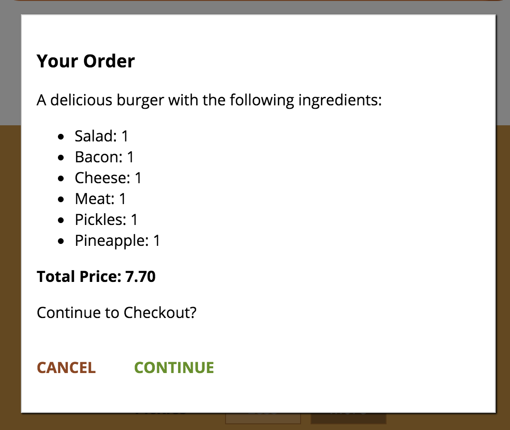

# Burger-App  串接API運作訂單功能
#### 在mLab的burger-app專案新增Collections orders

##### 在src/store/action/order.js，將purchaseBurger跟fetchOrders串連API
##### *本範例的orders api網址為``https://api.mlab.com/api/1/databases/burger-app/collections/orders?apiKey=0CoMXpFAZiYEoelEnhF6Ve5HRt7sOrzL``*
- 將漢堡訂單資訊送出至mlab
```diff
export const purchaseBurger = ( orderData, token ) => {
    return dispatch => {
        dispatch( purchaseBurgerStart() );
+       const url = "https://api.mlab.com/api/1/databases/burger-app/collections/orders?apiKey=0CoMXpFAZiYEoelEnhF6Ve5HRt7sOrzL";
-       axios.post( '/orders.json?auth=' + token, orderData )
+       axios.post( url, orderData )
            .then( response => {
                dispatch( purchaseBurgerSuccess( response.data.name, orderData ) );
            } )
            .catch( error => {
                dispatch( purchaseBurgerFail( error ) );
            } );
    };
};
```
- 從mlab獲取所有漢堡訂單資料
```diff
export const fetchOrders = (token, userId) => {
    return dispatch => {
        dispatch(fetchOrdersStart());
+       const url = "https://api.mlab.com/api/1/databases/burger-app/collections/orders?apiKey=0CoMXpFAZiYEoelEnhF6Ve5HRt7sOrzL";
+       axios.get( url )
-       const queryParams = '?auth=' + token + '&orderBy="userId"&equalTo="' + userId + '"';
-       axios.get( '/orders.json' + queryParams)        
            .then( res => {
                const fetchedOrders = [];
                for ( let key in res.data ) {
                    fetchedOrders.push( {
                        ...res.data[key],
                        id: key
                    } );
                }
                dispatch(fetchOrdersSuccess(fetchedOrders));
            } )
            .catch( err => {
                dispatch(fetchOrdersFail(err));
            } );
    };
};
```
##### 修改 src/App.js 在非登入狀態中提供checkout跟orders的路徑
```diff
  render () {
    let routes = (
      <Switch>
        <Route path="/auth" component={asyncAuth} />
        <Route path="/" exact component={BurgerBuilder} />
+       <Route path="/checkout" component={asyncCheckout} />
+       <Route path="/orders" component={asyncOrders} />        
        <Redirect to="/" />
      </Switch>
    );

    if ( this.props.isAuthenticated ) {
      routes = (
        <Switch>
          <Route path="/checkout" component={asyncCheckout} />
          <Route path="/orders" component={asyncOrders} />
          <Route path="/logout" component={Logout} />
          <Route path="/auth" component={asyncAuth} />
          <Route path="/" exact component={BurgerBuilder} />
          <Redirect to="/" />
        </Switch>
      );
    }

    return (
      <div>
        <Layout>
          {routes}
        </Layout>
      </div>
    );
  }
}
```
##### 修改 src/components/Navigation/NavigationItems/NavigationItems.js 顯示orders Item
```diff
    const navigationItems = ( props ) => (
        <ul className={classes.NavigationItems}>
            <NavigationItem link="/" exact>Burger Builder</NavigationItem>
+           <NavigationItem link="/orders">Orders</NavigationItem>
-           {props.isAuthenticated ? <NavigationItem link="/orders">Orders</NavigationItem> : null}
            {!props.isAuthenticated
                ? <NavigationItem link="/auth">Authenticate</NavigationItem>
                : <NavigationItem link="/logout">Logout</NavigationItem>}
        </ul>
    );
```
##### 修改 /src/containers/BurgerBuilder/BurgerBuilder.js 判斷是否跳出訂單結果
```diff
    purchaseHandler = () => {
+       this.setState( { purchasing: true } ) ;
-       if (this.props.isAuthenticated) {
-           this.setState( { purchasing: true } );
-       } else {
-           this.props.onSetAuthRedirectPath('/checkout');
-           this.props.history.push('/auth');
-       }
    }
```
##### 實際運作
- 訂單結果

- checkout 頁面

- checkout/contact-data 頁面

- 到mLab的burger-app/orders 看是否最新訂單進來

- orders 頁面

- 最新一筆訂單資訊
